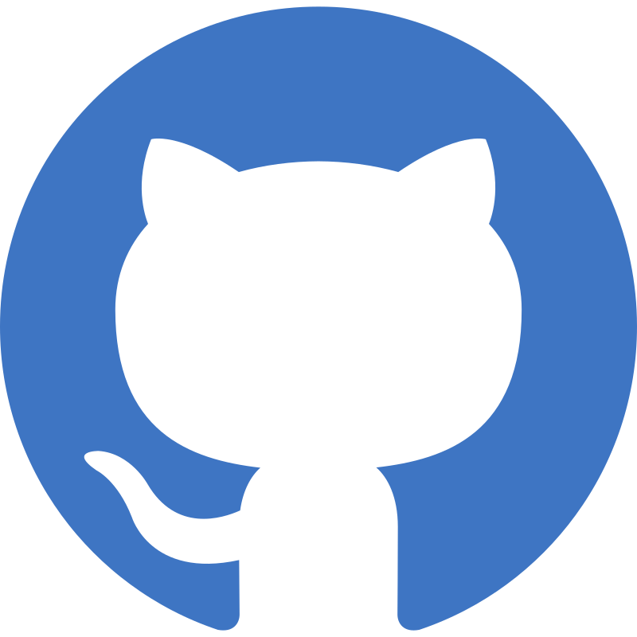

<div align="center">

```text
███████╗███████╗██████╗ ███╗   ██╗ █████╗ ███╗   ██╗██████╗  ██████╗ 
██╔════╝██╔════╝██╔══██╗████╗  ██║██╔══██╗████╗  ██║██╔══██╗██╔═══██╗
█████╗  █████╗  ██████╔╝██╔██╗ ██║███████║██╔██╗ ██║██║  ██║██║   ██║
██╔══╝  ██╔══╝  ██╔══██╗██║╚██╗██║██╔══██║██║╚██╗██║██║  ██║██║   ██║
██║     ███████╗██║  ██║██║ ╚████║██║  ██║██║ ╚████║██████╔╝╚██████╔╝
╚═╝     ╚══════╝╚═╝  ╚═╝╚═╝  ╚═══╝╚═╝  ╚═╝╚═╝  ╚═══╝╚═════╝  ╚═════╝
```                                        

</div>
<div>
  <h2>Olá, eu sou o Fernando 🧑‍💻</h2>
</div>


### Sobre mim

Sou estudante de [Ciência da Computação](https://www.pucminas.br/campus/lourdes/ensino/graduacao/Paginas/ciencias-da-computacao.aspx?moda=2&curso=180&local=bb24db1d-017d-4797-9656-a1a6b02b2d60) na [**PUC Minas**](https://www.pucminas.br/destaques/Paginas/default.aspx), atualmente cursando o **2º período**. Sempre fui interessado pela área da computação, tendo instalado minha primeira distro linux com 13 anos e resolvido meu primeiro conflito de drivers aos 14 😅. Previamente, fui intercambista no Alaska,EUA pelo programa de intercâmbio de jovens do rotary, onde entrei em contato com o setor de TI da [AVTEC](https://avtec.edu/), uma das escolas técnicas da região.
Tenho interesse especial por sistemas operacionais, automação, DevOps e tudo que envolve deixar ambientes de desenvolvimento mais rápidos, reprodutíveis, seguros e eficientes — não é acaso que configuro meu ambiente de desenvolvimento e ferramentas para serem mais eficiente e que me permitam realizar meus trabalhos e tarefas de forma mais rápida, simples e produtiva.

Gosto de entender como as coisas funcionam por "baixo dos panos", usando essa compreensão para melhorar a estruturação e código dos meus projetos, deixando os mais rápidos, simples de manter e levando em consideração a eficiência de uso de hardware.

---

### Meus Interesses Pessoais

- 🐧 Uso Desktop e servidores linux diariamente
- 🌐 Interesse por Redes, Infra e Cybersegurança
- 🧑‍💻 Programação competitiva
- 🤖 Interessado por IA/ML e Ciência de Dados
- 🖥️ Hobista de Homelabbing e Selfhosting
- </> Entusiasta de C, Zig e Go
- 💻 Gosto de desenvolver apps, TUIs e scripts para _use cases_ próprios
- 🎮 Adoro jogar jogos de estratégia, geopolítica e que envolvem administração, como ROME: Total War, Age of Empires, Victoria 2-3 e EUIV

---

### Contato

<table align="center">
  <tr>
    <!-- Professional -->
    <td align="center">
      <a href="https://fernandoleitepagani.github.io/My_Portfolio_Website_/" target="_blank">
        
      </a>
    </td>
    <td align="center">
      <a href="https://www.linkedin.com/in/fernandoleitepagani/" target="_blank">
        
      </a>
     <td align="center">
      <a href="https://www.github.com/fernandoleitepagani/" target="_blank">
        
      </a>  
    </td>
    <td align="center">
      <a href="https://lattes.cnpq.br/6096024024879687" target="_blank">
        
      </a>
    </td>
    <td align="center">
      <a href="mailto:fernando.leite@sga.pucminas.br" target="_blank">
        
      </a>
    </td>
    <!-- Social -->
    <td align="center">
      <a href="wa.me/553198284088" target="_blank">
        
      </a>  
    </td>
    <td align="center">
      <a href="mailto:fernando.leitepagani@protonmail.com" target="_blank">
        
      </a>
    </td>
    <td align="center">
      <a href="https://www.instagram.com/fernandoleitepagani/" target="_blank">
        
      </a>
    </td>
    <td align="center">
      <a href="YOUR_DISCORD_URL" target="_blank">
        
      </a>
    </td>
  </tr>
</table>

---

### Tecnologias e ferramentas

<table align="center"> <tr> <td align="center"><a href="https://getfedora.org/" target="_blank"></a></td> <td align="center"><a href="https://archlinux.org/" target="_blank"></a></td> <td align="center"><a href="https://www.debian.org/" target="_blank"></a></td> <td align="center"><a href="https://www.gnu.org/software/bash/" target="_blank"></a></td> <td align="center"><a href="https://git-scm.com/" target="_blank"></a></td> <td align="center"><a href="https://www.docker.com/" target="_blank"></a></td> <td align="center"><a href="https://neovim.io/" target="_blank"></a></td> </tr> <tr> <td align="center"><a href="https://www.open-std.org/jtc1/sc22/wg14/" target="_blank"></a></td> <td align="center"><a href="https://isocpp.org/" target="_blank"></a></td> <td align="center"><a href="https://www.java.com/" target="_blank"></a></td> <td align="center"><a href="https://jellyfin.org/" target="_blank"></a></td> <td align="center"><a href="https://syncthing.net/" target="_blank"></a></td> <td align="center"><a href="https://tailscale.com/" target="_blank"></a></td><td align="center"><a target="_blank"></a></td><td align="center"><a target="_blank"></a></td></tr> </table>

<div>
<table align="right">
<tr>
 <td align="center" colspan="1"></td>
</tr> 
<tr>
 <td align="center" colspan="1"></td>
</tr> 
</table>


  

---
<p align="center">
  
  
</p>

---


<br />


<br />


</div>
